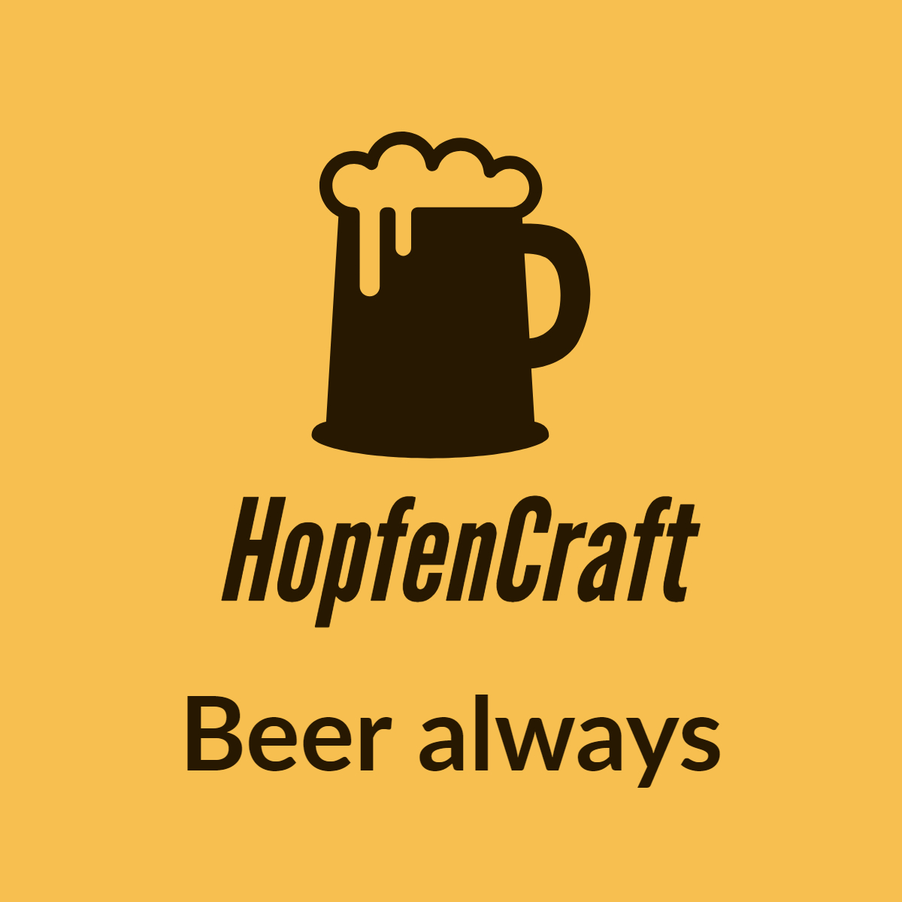

# HopfenCraft

    

    
    
    
    
    
    
    
    
    
    

A Beer shopping store backend made in Java Spring Boot

## License

This repository is released under the [MIT license](https://opensource.org/licenses/MIT).

If distributing this application, credits to the original author must not be removed.