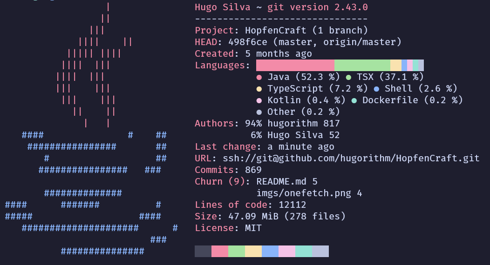

# HopfenCraft

## CI
[](https://github.com/hugorithm/HopfenCraft/actions/workflows/gradle.yml)  

## Onefetch 


## Website    


## Index

1. [HopfenCraft](#hopfencraft)
2. [CI](#ci)
3. [Onefetch](#onefetch)
4. [Website](#website)
5. [Features](#features)
6. [Service Monitoring with Prometheus and Grafana](#service-monitoring-with-prometheus-and-grafana)
7. [Project Architecture](#project-architecture)
8. [Installation](#installation)
   - [Environment Variables](#environment-variables)
   - [Docker](#docker)
9. [Generate RSA keys](#generate-rsa-keys)
10. [Compile the backend](#compile-the-backend)
11. [Create a Dashboard in Grafana](#create-a-dashboard-in-grafana)
12. [License](#license)

## Features

### User Management
- **User Accounts**: Register and log in to your personal HopfenCraft account.
- **User Profiles**: Update your user profile, change your password, and keep your information up to date.

### Admin Privileges
- **Admin Dashboard**: Admins have access to a powerful dashboard.
- **Product Management**: Add, update, or remove new beer products.
- **Stock Management**: Manage product stock levels with ease.

### Shopping Cart
- **Add to Cart**: Users can add their favorite beer products to the shopping cart.
- **Update Cart**: Modify quantities and remove items from your cart effortlessly.
- **Checkout**: Complete your beer order with our seamless checkout process.

### Orders
- **Create Orders**: Place orders for your favorite beers.
- **Order History**: View your order history and keep track of your purchases.

### Secure Payments
- **PayPal Integration**: Pay for your beer orders using PayPal or credit card.
- **Secure Transactions**: Rest assured that your payment information is handled securely.

## Service Monitoring with Prometheus and Grafana

I've also integrated Prometheus and Grafana to monitor the spring boot application.  


## Project Architecture


## Installation

To run the HopfenCraft application, you'll need to set up the following environment variables in both the frontend and backend components:

### Environment Variables

To configure the backend of the HopfenCraft application, you'll need to set the following environment variables:

- `DATABASE_URL`: Replace with your PostgreSQL database URL.
- `DB_PASSWORD`: Replace with your PostgreSQL database password.
- `DB_USERNAME`: Replace with your PostgreSQL database username.
- `EMAIL_HOST`: Replace with your email host configuration.
- `EMAIL_PASSWORD`: Replace with your email password.
- `EMAIL_PORT`: Replace with your email port number.
- `EMAIL_USERNAME`: Replace with your email username.
- `GITHUB_CLIENT`: Replace with your GitHub OAuth2 client ID.
- `GITHUB_SECRET`: Replace with your GitHub OAuth2 client secret.
- `GOOGLE_CLIENT`: Replace with your Google OAuth2 client ID.
- `GOOGLE_SECRET`: Replace with your Google OAuth2 client secret.
- `PAYPAL_CLIENT_ID`: Replace with your PayPal client ID.
- `PAYPAL_CLIENT_SECRET`: Replace with your PayPal client secret.
- `RSA_PRIVATE_EXPONENT`: Replace with your RSA private exponent.
- `RSA_PRIVATE_MODULUS`: Replace with your RSA private modulus.
- `RSA_PUBLIC_EXPONENT`: Replace with your RSA public exponent.
- `RSA_PUBLIC_MODULUS`: Replace with your RSA public modulus.
- `UPLOAD_FOLDER_PATH`: Replace with the path for file uploads.
- `VITE_GOOGLE_RECAPTCHA_KEY`: Replace with your Google reCAPTCHA site key.
- `VITE_PAYPAL_CLIENT_ID`: Replace with your PayPal Client ID:

Example `.bashrc` or `.zshrc`:
```zsh
# bakend
export DATABASE_URL=your-database-url
export DB_PASSWORD=your-database-password
export DB_USERNAME=your-database-username
export EMAIL_HOST=your-email-host
export EMAIL_PASSWORD=your-email-password
export EMAIL_PORT=your-email-port
export EMAIL_USERNAME=your-email-username
export GITHUB_CLIENT=your-github-client-id
export GITHUB_SECRET=your-github-client-secret
export GOOGLE_CLIENT=your-google-client-id
export GOOGLE_SECRET=your-google-client-secret
export PAYPAL_CLIENT_ID=your-paypal-client-id
export PAYPAL_CLIENT_SECRET=your-paypal-client-secret
export RSA_PRIVATE_EXPONENT=your-rsa-private-exponent
export RSA_PRIVATE_MODULUS=your-rsa-private-modulus
export RSA_PUBLIC_EXPONENT=your-rsa-public-exponent
export RSA_PUBLIC_MODULUS=your-rsa-public-modulus
export UPLOAD_FOLDER_PATH=your-upload-folder-path

# frontend
export VITE_GOOGLE_RECAPTCHA_KEY=your-recaptcha-site-key
export VITE_PAYPAL_CLIENT_ID=your-paypal-client-id
```
## Docker

To build and run, execute the following command in the project's root folder:
```zsh
docker compose up -d
```
This command will download, build and deploy all the containers.
Please keep in mind that since we are using Docker, you must use the service name defined in `docker-compose.yml` instead of `localhost` in your environment variables

And that's it! The containers should be up and running and HopfenCraft is available on [localhost:3000](http:localhost:3000)

There are also images on DockerHub:  
[hugorithm/hopfencraft-frontend](https://hub.docker.com/r/hugorithm/hopfencraft-frontend)
[hugorithm/hopfencraft-backend](https://hub.docker.com/r/hugorithm/hopfencraft-backend)

## Generate RSA keys

To generate the RSA keys you can execute the following command:
```zsh
openssl genpkey -algorithm RSA -out private_key.pem
```
```zsh
openssl rsa -pubout -in private_key.pem -out public_key.pem
```

## Compile the backend

To compile  you must run the following commands inside the `backend` folder:
```zsh
gradle clean build -x test
```
We will need to skip tests as we don't have a database yet.
The `-x test` flag indicates gradle to skip the test task.

If you have already setup a database just run `gradle clean build`

## Create a Dashboard in Grafana

To create a dashboard you need to define the datasource.  
You need to add a Prometheus datasoruce in the Grafana menu and then configure the endpoint.  
In our case the endpoint is `http://prometheus:9090`.   
After that it's just a matter of creating a dashboard with the already defined Prometheus datasource.  
Here is the [dashboard](https://grafana.com/grafana/dashboards/4701-jvm-micrometer/) I've used.  

## License

This repository is released under the [MIT license](https://opensource.org/licenses/MIT).

If distributing this application, credits to the original author must not be removed.
